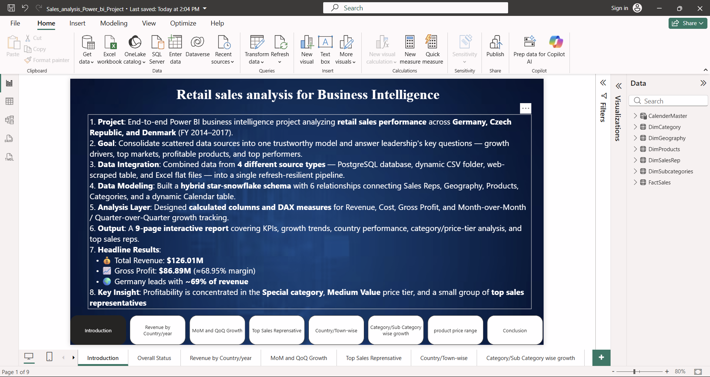
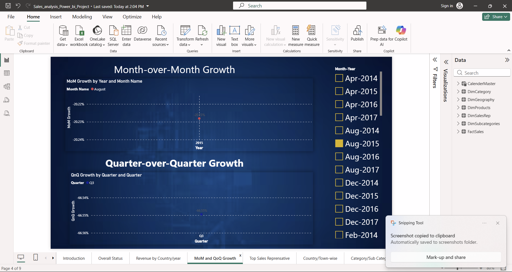
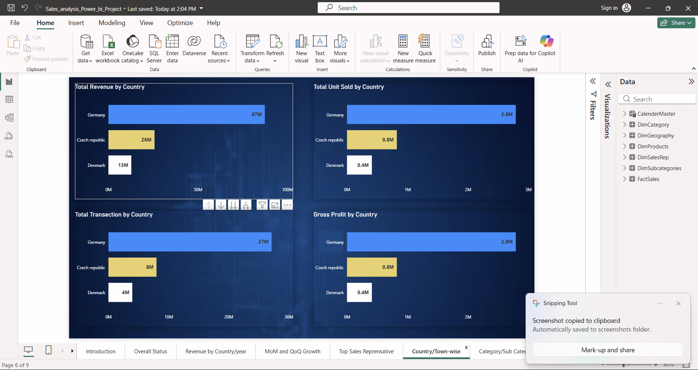
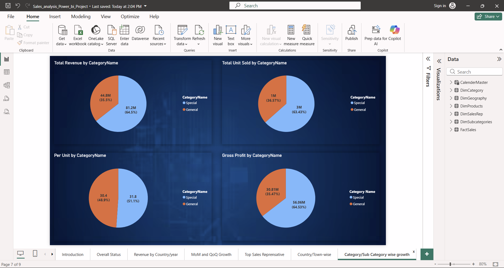
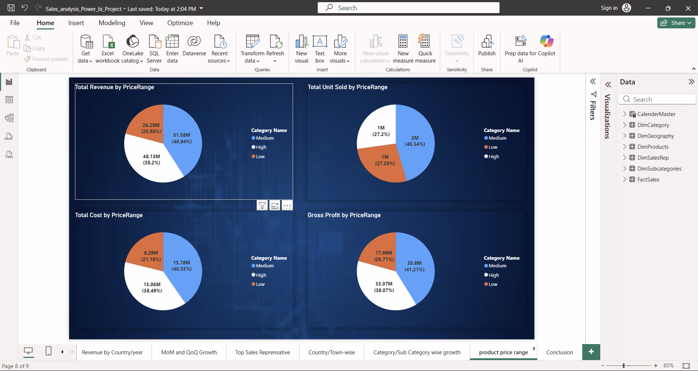
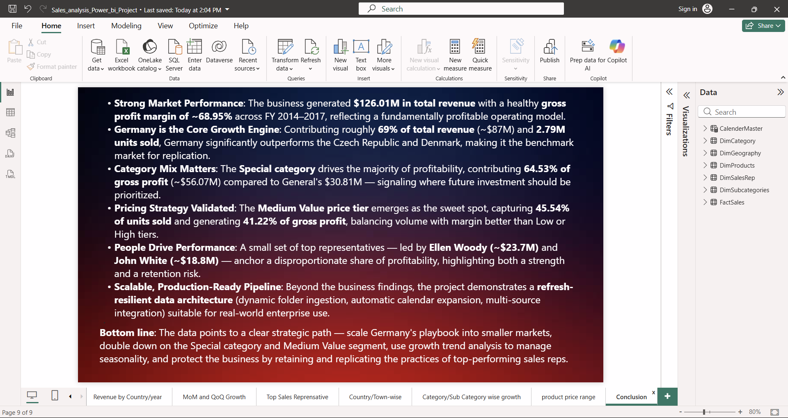

# 📊 Retail Sales Analysis using Power BI & SQL


A complete **Business Intelligence solution** built using **Power BI, SQL, Power Query (M), and DAX** to analyze retail sales performance across multiple European markets.

The project demonstrates the complete BI workflow—from **data extraction and transformation** to **data modeling, DAX calculations, and interactive dashboard development**.

---
# Dashboard Preview

## Introduction


## Overall KPI Dashboard


## Revenue Analysis


## Growth Analysis


## Sales Representative Performance


## Country Performance


## Category Analysis


## Product Price Analysis


## Business Conclusion

---

# Project Overview

Retail companies often maintain data across multiple disconnected systems including databases, spreadsheets, CSV files, and external sources.

This project consolidates those sources into a unified analytical model capable of answering key business questions related to:

- Revenue Growth
- Profitability
- Product Performance
- Sales Representative Performance
- Country-wise Sales
- Time Intelligence
- Product Category Analysis

The final deliverable is a **9-page interactive Power BI dashboard** built using industry-standard BI practices.

---

# Business Objectives

The dashboard helps stakeholders answer questions such as:

- Which country generates the highest revenue?
- Which sales representatives contribute most to profit?
- Which product categories are most profitable?
- Which price segment performs best?
- How does revenue change Month-over-Month?
- How does performance vary Quarter-over-Quarter?
- Which markets should receive future investment?

---

# Key Business Results

| KPI | Value |
|------|---------|
| Total Revenue | **$126.01M** |
| Total Cost | **$39.13M** |
| Gross Profit | **$86.89M** |
| Gross Profit Margin | **68.95%** |
| Countries | Germany, Czech Republic, Denmark |
| Time Period | 2014–2017 |

---

# Data Sources

The project integrates data from **4 different sources**.

| Dataset | Source |
|----------|---------|
| Fact Sales | CSV Folder |
| Product Master | PostgreSQL |
| Geography | Web Source |
| Categories | Excel |
| Sub Categories | Excel |
| Sales Representatives | Excel |

---

# ETL Process (Power Query)

Data preparation included:

- Importing multiple CSV files dynamically
- PostgreSQL database connection
- Web scraping
- Data cleaning
- Duplicate removal
- Null handling
- Data type correction
- Splitting composite columns
- Lookup table merging
- Creating surrogate keys
- Dynamic folder refresh

---

# Data Model

The project follows a **Hybrid Star-Snowflake Schema**.

```
          Category
              |
        SubCategory
              |
Products ---- FactSales ---- Geography
              |
          SalesRep
              |
         Calendar
```

Relationships

- 6 Relationships
- One-to-Many
- Single Direction Filtering
- Calendar Table for Time Intelligence

---

# Calendar Table

A dynamic calendar table was created using DAX.

```DAX
Calendar =
CALENDAR(
MIN(FactSales[Date]),
MAX(FactSales[Date])
)
```

Additional columns:

- Year
- Quarter
- Month
- Month Name
- Month-Year
- Week
- Weekday
- Sorting Columns

---

# DAX Measures

Some of the key measures include:

### Revenue

```DAX
Total Revenue
```

### Cost

```DAX
Total Cost
```

### Gross Profit

```DAX
Gross Profit
```

### Gross Margin %

```DAX
Gross Margin %
```

### Revenue per Unit

```DAX
Revenue per Unit
```

### Previous Month Revenue

```DAX
Previous Month Revenue
```

### Month-over-Month Growth

```DAX
MoM Growth %
```

### Quarter-over-Quarter Growth

```DAX
QoQ Growth %
```

### Average Discount

```DAX
Average Discount
```

### Total Transactions

```DAX
Transaction Count
```

---

# Dashboard Pages

| Page | Description |
|-------|-------------|
| Introduction | Project Summary |
| Overall Status | KPI Cards |
| Revenue Analysis | Country & Year Performance |
| MoM & QoQ Growth | Time Intelligence |
| Sales Representative | Profit by Salesperson |
| Country Analysis | Revenue, Units & Profit |
| Category Analysis | Category-wise Performance |
| Price Range Analysis | Low / Medium / High Products |
| Conclusion | Business Insights |

---

# Business Insights

## Germany dominates the business

- ~69% of total revenue
- Highest gross profit
- Largest sales volume

---

## Special Category performs best

- Generates **64.5%** of gross profit
- Largest contributor to company profitability

---

## Medium Price products are the sweet spot

- Highest unit sales
- Highest profit contribution
- Best balance between volume and margin

---

## Revenue is concentrated

Top performers include:

- Ellen Woody
- John White

A small group of representatives contributes a significant share of total profit.

---

# Technologies Used

- Microsoft Power BI
- Power Query (M)
- DAX
- PostgreSQL
- SQL
- Microsoft Excel
- CSV
- Web Data Connector

---

# Repository Structure

```
Sales_Analysis_on_Power_Bi-SQL/

│
├── Data/
│   ├── CSV Files
│   ├── Excel Files
│   └── PostgreSQL Scripts
│
├── Images/
│
├── PowerBI Report/
│   └── Sales_Analysis.pbix
│
├── outputs/
│   ├── 01-introduction.png
│   ├── 02-overall-stats.png
│   ├── ...
│
├── README.md
│
└── LICENSE
```

---

# Getting Started

## Clone Repository

```bash
git clone https://github.com/yourusername/Sales_Analysis_on_Power_Bi-SQL.git
```

Open the `.pbix` file in **Power BI Desktop**.

Update the data source paths if required.

Refresh the model.

---

# Skills Demonstrated

- Business Intelligence
- Data Visualization
- Dashboard Design
- SQL
- PostgreSQL
- Power Query
- Data Cleaning
- ETL
- Data Modeling
- Star Schema
- Snowflake Schema
- DAX
- Time Intelligence
- KPI Design
- Business Analytics

---

# Future Improvements

- Power BI Service Deployment
- Scheduled Refresh
- Incremental Refresh
- Drill-through Reports
- Row-Level Security (RLS)
- Forecasting
- What-if Analysis

---

# Author

**Rajan kumar**

LinkedIn: https://linkedin.com/in/rajan-kumar263

GitHub: https://github.com/Rajan263

---

⭐ If you found this project helpful, consider giving it a star.
